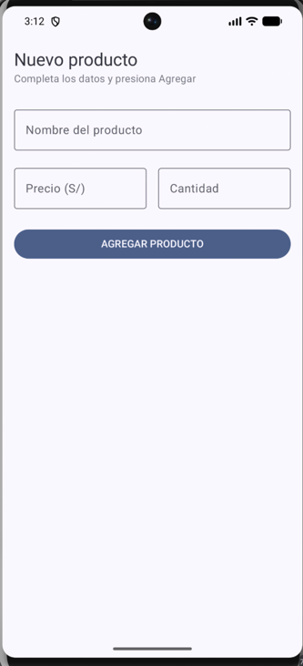
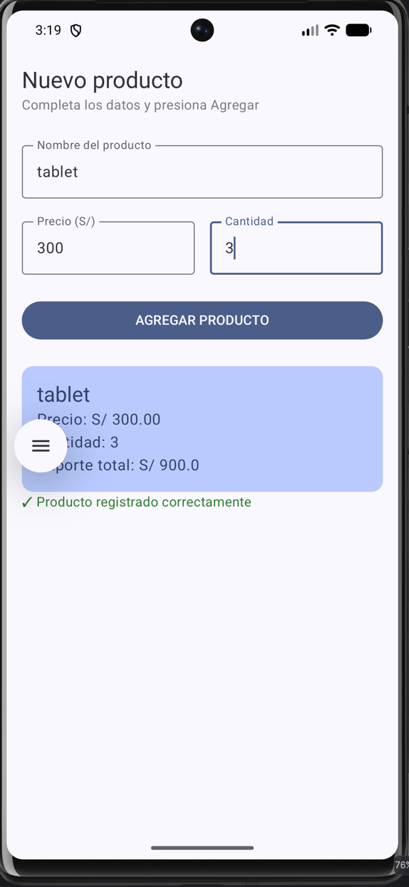

titulo: Lab03_AgregarProducto
Nombre: Alexandra Ximena Quispe Mallqui
Descripcion: Laboratorio realizado con la finalidad de comprender la sintaxis y la  forma en como generan front en kotlin.

 

¿qué pasaría si declaras las variables de los campos SIN remember?

Lo que pasaria es que al momento de voltear el celular o si el sistema vuelve a compilar de 0, los valores que hemos estado avanzando se borrarian, por ello es importante implementarlo para que de esta manera evitenmos ese tipo de caos 