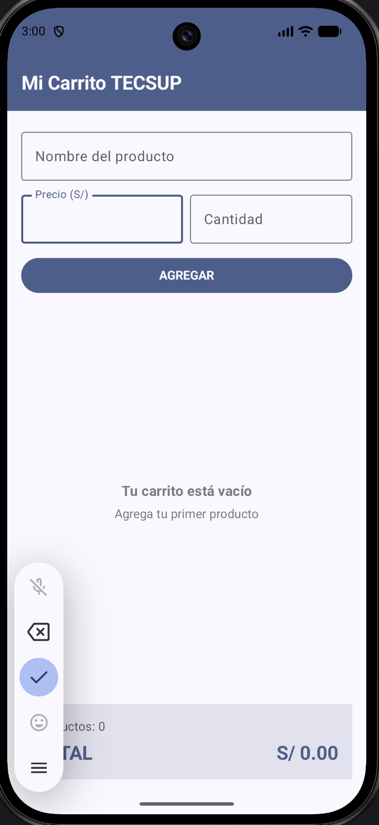
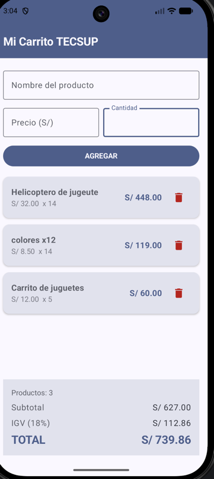

# Lab04: Mi Carrito TECSUP

**Curso:** Programación en Móviles — 4to Ciclo

## Descripción del Proyecto
Aplicación móvil en Kotlin y Jetpack Compose que implementa un carrito de compras dinámico. Permite ingresar productos con precio y cantidad, mostrarlos en una lista optimizada con `LazyColumn`, eliminarlos con un cuadro de diálogo de confirmación y calcular en tiempo real el Subtotal, IGV (18%), descuentos aplicables y el Total final.

---

## Respuestas a Preguntas Conceptuales

1. **¿Por qué `mutableStateListOf` y no una `MutableList` normal?**  
   `mutableStateListOf` crea una lista observable por el motor de Jetpack Compose. Cuando agregamos o eliminamos elementos, Compose detecta la modificación del estado y recompone automáticamente la interfaz gráfica para actualizar la lista en pantalla. Una `MutableList` estándar modificaría los elementos internamente, pero no notificaría a Compose, dejando la UI estática.

2. **¿Por qué la lista se declara con `val` y aún así podemos agregarle elementos?**  
   La palabra clave `val` indica que la **referencia del objeto** no puede cambiar (es decir, no podemos asignarle otra instancia de lista diferente con el operador `=`). Sin embargo, el objeto interno es mutable, por lo que podemos llamar a sus funciones de mutación como `.add()` o `.remove()` para alterar su contenido.

3. **¿Qué hace `weight(1f)` en la `LazyColumn`?**  
   El modificador `weight(1f)` dentro del `Column` le indica a la `LazyColumn` que debe expandirse dinámicamente para ocupar todo el espacio vertical sobrante disponible. Esto garantiza que la lista sea desplazable y mantenga el panel de totales fijo en la parte inferior de la pantalla sin importar cuántos productos existan.

---

## Capturas de Pantalla

| Estado Vacío | Lista de Productos y Totales |
|:------------:|:----------------------------:|
|      **      |              **              |